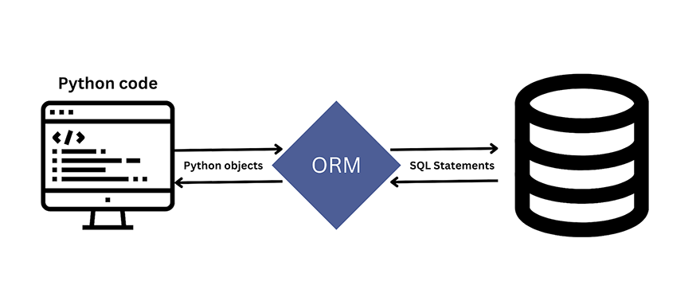
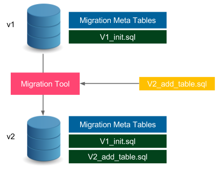

<h2>SQLAlchemy & Alembic</h2>


---

<h3><strong> ✅ Objectives </strong></h3>

* Understand what SQLAlchemy is and how it's beneficial as an ORM
* Know how to create a database with SQLAlchemy
* Create schema
* Understand what Alembic is and how it works with SQLAlchemy
* Configure an app to use Alembic
* Create and apply migrations
* Execute full CRUD using SQLAlchemy

---

### What is SQLAlchemy?

> "SQLAlchemy is the Python SQL  toolkit and Object Relational Mapper that gives application developers the full power and flexibility of SQL."


---


xxx



---


### What is a **schema**?

A **schema** is the blueprint of a database. It describes how data relates to other data in tables, columns, and the relationships between

We define our schema with Python classes we will call "models".

---

First we import the elements we'll need from SQLAlchemy...

```python
from sqlalchemy import Column, Integer, PrimaryKeyConstraint, String
from sqlalchemy.ext.declarative import declarative_base

Base = declarative_base()
```

---

Then we create a model class which inherits the ORM functionality from the Base class.

```python[1|2|4|5-8]
class Pet(Base):
    __tablename__ = "pets"

    id = Column(Integer(), primary_key=True)
    name = Column(String())
    species = Column(String())
    breed = Column(String())
    temperament = Column(String())
```

---

For debugging and readability, let's add a `__repr__()` to our model!

```python
class Pet(Base):

  # (...model logic...)

  def __repr__(self):
    return (
            f"Id: {self.id}, "
            + f"Name:{self.name}, "
            + f"Species {self.species}, "
            + f"Breed {self.breed}, "
            + f"Species {self.temperament}"
        )

```
#### Let's jump into the code! {.fragment}

---

### What is an **engine**?

In SQLAlchemy, an **engine** is a Python object that translates SQL to Python and vice-versa.
It is similar to our `connection` object in `sqlite3`.
We'll need an engine to apply our schema to our database.

---


---

### What is a **session**?

A Python object that uses an engine to allow us to programmatically interact with a database.

---


<section data-background-color="mistyrose">
  <h3>What is a <strong>transaction</strong>?</h3>
  <p>A strategy for executing database statements such that the group suceeds or fails as a unit.</p>
  
</section>

xxx

<section data-background-color="mistyrose">
  <div style="display: flex;">
    <div style="width: 35%">
      
    </div>
    <div style="width: 65%">
      
    </div>
  </div>
</section>

---

### What is **Alembic**?

A database migration tool written by the author of SQLAlchemy

---

<section data-background-color="mistyrose">
  <h3>What is a schema migration?</h3>
  <p>A controlled, incremental and reversible change to a relational database's schema.  A set of migrations can be applied to a database, or rolled back in a sequential and granular fashion.
  </p>
  
</section>

---



---


---


<section data-background-color="mistyrose" >
  <h3>Classes and Instances</h3>
  
</section>


---

### A Python Class is...

* a blueprint or template for creating individual objects
* a data structure which assigns values and methods to objects

<div style="display: flex;">
  <div style="width: 35%; height: 100%">
    
  </div>

  <div style="width: 65%; height: 100%">
    
  </div>
</div>

---

### An object is...

<div style="display: flex;">
  <div style="font-size: 1.75rem; width: 50%">
    <ul>
      <li> an individual collection of variables (attributes), functions (methods), and data structures</li>
      <li> constructed from a class</li>
      <li> also called an 'instance'</li>
      <li> a representation of a real world object or event</li>
    </ul>
  </div>

  <div style="width: 50%">
    
    
  </div>
</div>


---

#### You actually already have some experience with classes and instances!

<pre>
  <code class="language-python" data-trim >
    type("hello") # => < class 'str'>
    42.__class__ # => < class 'int'>
  </code>
</pre>

<p>What happens when you enter <code>dir("world")</code> in a Python shell?</p>

#### Let's build a class and some instances! 👷

---

#### Some strengths of OOP

* having total control of what objects look like just by updating their class

#### Some weaknesses of OOP

* becuase my objects have to conform to a class, I lose flexibility in changing their attributes without changing the class

---

#### Example Application Domains

* healthcare {.fragment}
* FinTech/banking {.fragment}
* insurance {.fragment}
* sales {.fragment}
* eCommerce {.fragment}
* accounting {.fragment}
* booking software for hospitality and travel {.fragment}

---

#### OOP Design Principles 🧭

* single responsibility
* separation of concerns
* DRY
* domain modeling

---

#### Single Responsibility

<div style="display: flex;">
  <div style="width: 50%">
    
  </div>

  <div style="width: 50%">
    
  </div>
</div>

xxx

<div style="display: flex;">
  <div style="width: 45%">
    
    <h5 class="fragment" style="color:red">Overloaded 🚫<h5>
  </div>

  <div style="width: 55%">
    
    
    <h5 class="fragment" style="color:green">Classes separated to reduce complexity of our classes 👍</h5>
  </div>
</div>

---

#### Separation of Concerns

* Supports high cohesion among components {.fragment} 
* Supports low coupling among components {.fragment}
* Increases modularity {.fragment}
* Increases maintainability {.fragment}
* Increases reusability {.fragment}

xxx

<h5>Cohesion</h5>


* cohesive components perform only one task
* cohesion is the internal glue that keeps a module together
* it is a measure fo the degree to which the elements in the module are functionally related

---

<section data-background-color="mistyrose">

  <h5>Coupling</h5>

  <div style="display: flex;">
  <div style="width: 50%">
    
  </div>

  <div style="width: 50%">
    <ul style="font-size: 1.5rem">
      <li class='fragment'>good software has low coupling</li>
      <li class='fragment'>coupling increases with the number of calls or the amount of data shared between modules</li>
      <li class='fragment'>a design with high coupling will have more errors</li>
      <li class='fragment'>it measures the degree of interdependence between modules</li>
    </ul>
  </div>
</div>

</section>


---

##### D.R.Y. 🌞🌵

<iframe width="760" height="515" src="https://www.youtube.com/embed/8hOZe5oVzJY" title="YouTube video player" frameborder="0" allow="accelerometer; autoplay; clipboard-write; encrypted-media; gyroscope; picture-in-picture; web-share" allowfullscreen></iframe>

---

#### Domain Modeling 📐

<div style="display: flex;">
  <div style="width: 40%; font-size: 2rem">
    <p>A structured visual representation of interconnected concepts or real-world objects that incorporates vocabulary, key concepts, behavior, and relationships of all its entities.</p>
  </div>

  <div style="width: 60%">
    
   
  </div>
</div>


xxx


---

#### How will objects help us going forward? 🚗 

<div style="display: flex">
  <div style="width: 50%" >
    
  </div>

  <div style="width: 50%">
    
  </div>
</div>

xxx


---

<section data-background-image="https://media.giphy.com/media/3oKGzEisePrzPMOWEo/giphy.gif" data-background-size="1200px">
 

</section>


---


